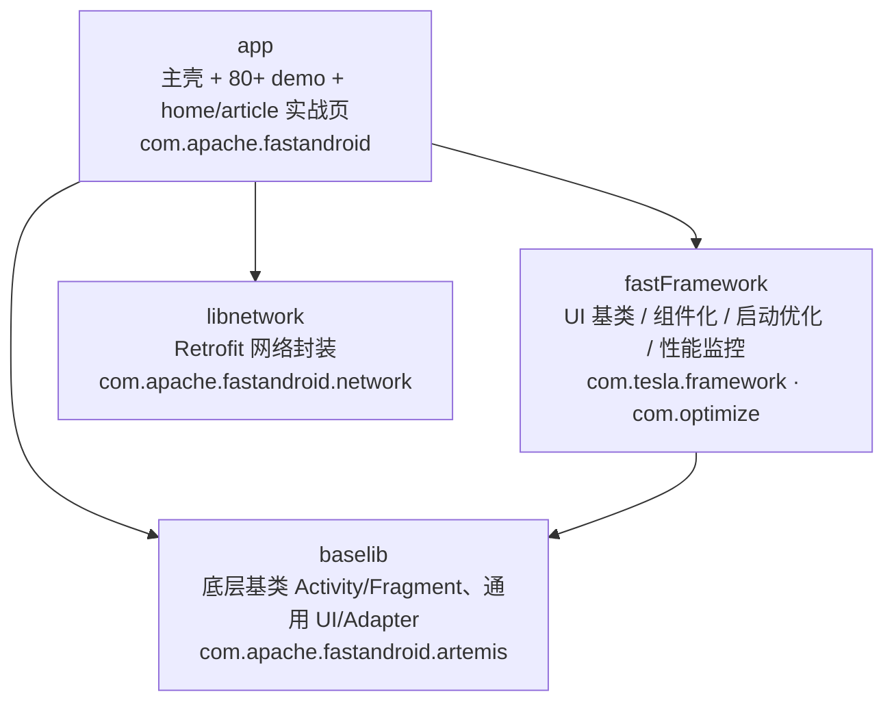

# FastAndroid

> Android **技术演示 / 知识点练习型工程**（learning playground）。一个主壳 App 通过列表页导航进入 80+ 个相互独立的可运行 demo，每个 demo 对应一个知识点；配套自研框架层、网络层与构建工程化实践。

非线上产品，定位是「对照学习」：同一能力常并存 MVVM / MVI / RxJava / Flow / 协程 等多种实现。

---

## 架构总览



依赖方向单向、不得反向。`settings.gradle` 当前仅启用 `app`、`fastFramework`、`baselib`、`libnetwork` 四个模块。
更完整的分层、启动流程与数据流见 [概要设计](docs/overview-design.md)。

---

## 技术栈

| 维度 | 选型 |
|------|------|
| 语言 | Kotlin + Java 混用 |
| UI | DataBinding / ViewBinding、RecyclerView（BRVAH） |
| 架构 | MVVM、MVI、Repository、Hilt（DI） |
| 异步 | Kotlin 协程 / Flow、RxJava3 |
| 网络 | Retrofit + 自定义 CallAdapter（`NetworkResult` / `ApiResult` / LiveData） |
| 监控 | launchstarter（启动优化）、takt（FPS）、watchdog（卡顿）、omagnifier（内存）、LeakCanary |
| 构建 | Gradle 多模块 + `buildSrc`（Kotlin）集中管理依赖/版本/插件 |

环境：`applicationId com.apache.fastandroid` · compileSdk 30 · minSdk 26 · targetSdk 30。

---

## 快速开始

**前置**
- Android Studio（推荐）或本地 Android SDK
- 在根目录 `local.properties` 配置 `sdk.dir=/path/to/Android/sdk`
- release 签名依赖根目录 `prod.properties`（不提交，按需配置）

**构建与运行**（按 `<flavor><BuildType>` 组合，flavor 维度 `env` 取值 `free` / `prod`）

```bash
./gradlew assembleFreeDebug                                  # 构建 free debug APK
./gradlew assembleProdRelease                                # prod release（混淆 + 资源混淆）
./gradlew :app:assembleDebug -x lint -x test --no-daemon     # 快速校验编译
./gradlew testFreeDebugUnitTest                              # 本地 JVM 单测
./gradlew connectedFreeDebugAndroidTest                      # 设备/模拟器仪器测试
./gradlew clean                                             # 清理构建产物
```

运行单个测试类：`./gradlew testFreeDebugUnitTest --tests "com.apache.fastandroid.XxxTest"`。

---

## 模块一览

| 模块 | 命名空间 | 职责 |
|------|----------|------|
| `app` | `com.apache.fastandroid` | 主壳 + 全部 demo（`demo/` 按知识点分子包、`jetpack/` 专题）+ `home`/`article` 网络实战页 |
| `fastFramework` | `com.tesla.framework` · `com.optimize` · `com.tencent.lib` | UI 基类、`applike` 组件化、`launchstarter` 启动优化、`performance` 卡顿/内存监控、50+ 通用组件 |
| `baselib` | `com.apache.fastandroid.artemis` | 更底层的基类 Activity/Fragment 与通用 UI/Adapter |
| `libnetwork` | `com.apache.fastandroid.network` | Retrofit 封装：`api`/`retrofit`/`calladapter`/`interceptor`/`model` |

---

## 文档索引

| 文档 | 内容 |
|------|------|
| [docs/overview-design.md](docs/overview-design.md) | 概要设计：总体架构、模块职责、启动流程、数据流、构建工程化 |
| [docs/api.md](docs/api.md) | 网络 API：各 Retrofit 接口的端点、参数、响应与 base URL |
| [docs/AI_LOOP.md](docs/AI_LOOP.md) | AI 自动优化循环（跑 check → 修复 → 再校验 → 自动提交）说明 |
| [docs/README.md](docs/README.md) | 文档目录索引 |

---

## 扩展规范（新增 demo）

1. 在 `app/.../demo/<知识点>/` 下新建子包；
2. 继承 fastFramework/baselib 合适基类（如 `BaseBindingFragment`、`BaseListFragment`）；
3. 在对应列表 Fragment（`DemoListFragment` / `JetPackDemoFragment` / `KotlinDemoListFragment`）注册入口；
4. 新增依赖改 `buildSrc/Libs.kt`（+ `Versions.kt`），勿在 `build.gradle` 硬编码；
5. 不修改公共主流程，以免影响其它 demo。

详细协作约定见 [AGENTS.md](AGENTS.md) 与 [CLAUDE.md](CLAUDE.md)。

---

## 维护

- 维护者：JerryLiu3502 · jerryliu.info@gmail.com
- 仓库：https://github.com/JerryLiu3502/FastAndroid
- 许可证：仓库未声明 LICENSE。如需开源分发请补充许可证文件。

> 注意：`sign/`、APK 归档、`prod.properties` 视为敏感，请勿提交。
